# Hangman Game

# Introduction

Project 3 for Code Institute Full-stack development program: Python Essentials

The Hangmann is believed to have originated in England during the 17th century. Criminals who were sentenced to death by hanging could demand the "Rite of Words and Life."

In the "Rite of Words and Life," a criminal to be hanged was strung up over a 5 legged stand, and a board with a series of short ropes representing a word was displayed. The Executioner would pick the word, and would use charcoal to mark correctly guessed letters on the dashes of the board and incorrect letters to the side. At every incorrect guess, the executioner would use a sledgehammer or axe to knock away a single leg of the stand. 5 wrong guesses and the criminal was hanged. If the entire word was filled in correctly or guessed, the condemned would be set free from that sentence and not tried again for that crime.

View the Hangman live game [HERE](https://hangmann-game-051c0aa67667.herokuapp.com/)

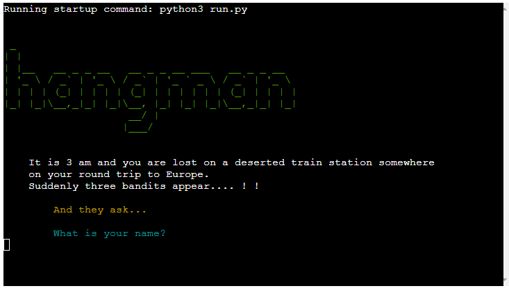

# Table of Contents

- [Hangman Game](#hangman-game)
- [Introduction](#introduction)
- [Site Goals:](#site-goals)
- [User Experience - UX](#user-experience-ux)
   * [User Stories](#user-stories)
         - [New User:  ](#new-user)
         - [Returning User:](#returning-user)
- [Development Planes:](#development-planes)
   * [Strategy](#strategy)
      + [Roles: ](#roles)
      + [Demographic:](#demographic)
      + [Psychographic:](#psychographic)
         - [Lifestyle:](#lifestyle)
         - [The website needs to allow users to:  ](#the-website-needs-to-allow-users-to)
         - [The website needs to allow the developer to:  ](#the-website-needs-to-allow-the-developer-to)
   * [Scope:  ](#scope)
      + [Content Requirements:](#content-requirements)
      + [Functionality Requirements:](#functionality-requirements)
   * [Skeleton](#skeleton)
   * [Surface](#surface)
- [How to play](#how-to-play)
- [Features](#features)
   * [Logo and Welcome Information for Users](#logo-and-welcome-information-for-users)
   * [User Input](#user-input)
      + [Invalid Name Input Error](#invalid-name-input-error)
      + [Invalid City Input Error](#invalid-city-input-error)
   * [Rules of the Game and the Scoring System](#rules-of-the-game-and-the-scoring-system)
   * [Masked Random Word Display](#masked-random-word-display)
   * [Game](#game)
   * [Playing the game](#playing-the-game)
      + [First Correct Letter](#first-correct-letter)
      + [During the game](#during-the-game)
      + [Same correct letter](#same-correct-letter)
      + [Correct Word Input](#correct-word-input)
      + [End of the second game:](#end-of-the-second-game)
      + [Wrong word input](#wrong-word-input)
   * [Hangman Stages](#hangman-stages)
      + [Hangman Stage 1](#hangman-stage-1)
      + [Hangman Stage 2](#hangman-stage-2)
      + [Hangman Stage 3](#hangman-stage-3)
      + [Hangman Stage 4](#hangman-stage-4)
      + [Hangman Stage 5](#hangman-stage-5)
      + [Hangman Stage 6](#hangman-stage-6)
   * [End Choices](#end-choices)
      + [Play again](#play-again)
      + [Leaderboard](#leaderboard)
      + [Exit Game](#exit-game)
   * [Future Features](#future-features)
      + [Multiple-player option](#multiple-player-option)
      + [Different word categories](#different-word-categories)
      + [Wider range of words](#wider-range-of-words)
      + [Use of the datetime module](#use-of-the-datetime-module)
      + [More advanced graphics](#more-advanced-graphics)
      + [Updated Scoring System](#updated-scoring-system)
      + [Feedback section](#feedback-section)
      + [Correction section](#correction-section)
- [Storage Data](#storage-data)
   * [Code to Connect to Google Sheet](#code-to-connect-to-google-sheet)
   * [Google Sheet Hangman Leaderboard](#google-sheet-hangman-leaderboard)
- [Technolgies Used](#technolgies-used)
   * [Language Used](#language-used)
   * [Python Packages](#python-packages)
   * [Frameworks - Libraries - Programs Used](#frameworks-libraries-programs-used)
- [Testing](#testing)
   * [Code Institute Python Linter ](#code-institute-python-linter)
   * [Manual Testing](#manual-testing)
   * [Input validation testing](#input-validation-testing)
      + [Enter player name](#enter-player-name)
      + [Enter player city](#enter-player-city)
      + [Enter a letter or word](#enter-a-letter-or-word)
      + [Play Again Input](#play-again-input)
- [Bugs ](#bugs)
   * [Fixed Bugs](#fixed-bugs)
   * [Unfixed Bugs](#unfixed-bugs)
- [Deployment](#deployment)
   * [Deploying on Heroku ](#deploying-on-heroku)
   * [Forking the GitHub Repository ](#forking-the-github-repository)
   * [Local Clone](#local-clone)
- [Credits](#credits)
   * [Information Sources/Resources](#information-sourcesresources)
   * [Content](#content)
      + [Images](#images)
- [Acknowledgements](#acknowledgements)

# Site Goals:

The goals for this site are as follows:
* To provide the player with a fun, intellectual, and engaging game.
* Provide the player the ability to see the top players´ scores and compete against them.

# User Experience - UX

## User Stories

#### New User:  
* As a new user, I am looking to find information on how to play the game.  
* As a new user, I am looking to enjoy playing the game.   
* As a new user, I would like to see my scores and the scores of the top players.  

#### Returning User:
* As a returning user, I would like to continue to increase my score by playing many games to compete with the top players.

# Development Planes:
To create a game that is comprehensive and engaging for a user, as a developer you need to look at all aspects of the game and how someone who visits your app will use it. You have to consider all the user stories that have been outlined in the above sections.  

## Strategy
The strategy principal looks at user needs, as well as product/service objectives. This website's target audience was broken down into three categories:

### Roles: 
* New User
* Existing User  

### Demographic:
* People aged between 16 and 65 years

### Psychographic:

#### Lifestyle:
* People interested in online games.
* People interested in online intellectual games.   

#### The website needs to allow users to:  
* Easily enter a username and city
* Easily enter letters to play the game
* Get live feedback on whether the answer is correct or incorrect
* See the correct answer if they lose the game.
* See their scores and cumulative scores if they play many games.
* See the scores of the top 5 players.
* Exit the game after at least playing once.

#### The website needs to allow the developer to:  
* Keep track of the user's name, user´s city, date, and scores using Google Worksheets.
* Keep track of all letters and words guessed and add them to respective lists, alerting the user if they have already guessed this letter or word and if it was correct or wrong.
* Calculate scores for guessing the letters of the word or for guessing the whole word.
* Cumulatively record the scores of the user from all the games they play.

## Scope:  

With the structure in place, it was then time to move onto the scope plane. This was all about developing website requirements based on the goals set out in the strategy plan. These requirements are broken down into two categories.

### Content Requirements:
The user will be looking for:
* Information on how to play the game and the scoring system.
* Feedback during the game about the letters or words they input.
* Information about the attempts left during the game.
* The right word to be displayed if they lose.
* Information about the top player´s scores.
* The ability to play again to improve their score or exit the game.

### Functionality Requirements:
The user will be able to:
* Give their name and city.
* Decide if they want to play again, see the leaderboard, or exit the game at the end of playing a game.

## Skeleton:
* The skeleton of the project was represented with a flowchart using [Draw.io](https://app.diagrams.net/) to create the flowchart.

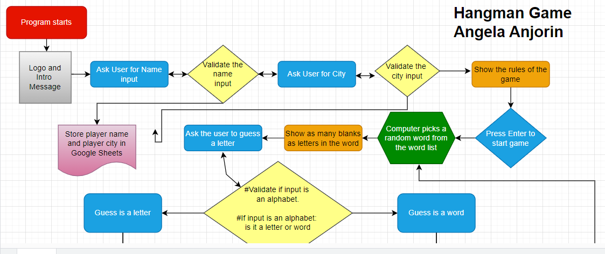

[Flowchart Here ](https://drive.google.com/file/d/1Axjon_D9vPIazVU5QZqiOfiUjHXWsR2w/view?usp=sharing)

## Surface
To make this game a bit more user-friendly, I used color and a typewriting technique to make the game more interesting with a background story.
* The game begins with a green logo.
* With the typewriter the beginning of the story preceding the game is told.
* Invalid inputs and wrong answers are highlighted in red.
* The leaderboard is displayed in green and in a clear table form.

# How to play
The traditional way to play the Hangman games was played with pen and paper. It typically involved two players, one would come up with a word and write the amount of dashes on the piece of paper representing the amount of letters in the word. The other player would guess the letters of the word and for each correct letter get it filled in the blank spaces. For wrong letters the image of the hangman will be drawn, starting with the head of the man, the body, both arms, and then the legs. 

In this version of the game, a background story is told about a person (the player), who is lost in a deserted train station in Europe and is met by 3 bandits who ask the lost traveler for their name and the city they come from. Then the rules of the game are laid out and the game starts. The computer generates a random word from the word list of cities in Europe. It gives a hint to the player by informing them of how many letters the word has.

The user then can guess the word by either typing a letter or a word and they get feedback telling them if the input was correct or wrong. For every initial wrong input, they lose an attempt from the 6 original attempts and the image of the hangman starts to be built. A list of the wrongly guessed inputs is shown to the user. They lose the game when all attempts have been used up. 

Scores are added up for the correct inputs according to the illustrated scoring system. For a very correct letter, they gain 10 points, for guessing the whole word letter for the letter a bonus of 100 points is added. If they guess the whole word, they get a total score of 500.

At the end of the game, the player gets to choose from 3 options: to either play again, see the leaderboard, or exit the game. If they choose to play again, the game repeats, with the exception of showing them thereafter a cumulative total score result at the end of every game played. If they choose to see the leaderboard, they are shown the scores of the top five players. If they choose to exit, the program ends.

# Features

## Logo and Welcome Information for Users

* The logo is the first thing that the user sees. Then a story is told with a typewriter to capture the interest and curiosity of the user. It tells them that it is 3 am and they are lost in a deserted train station when 3 bandits appear.
[Live](https://hangmann-game-051c0aa67667.herokuapp.com/)

## User Input

* Continuing the narrative, the bandits ask the user for their name and the city they are from.

### Invalid Name Input Error

* If the user presses enter without entering a name, an error message informs the user of the invalid input and they are prompted again to input their name.

### Invalid City Input Error

* If the user presses enter without entering a city, an error message informs the user of the invalid input and they are prompted again to input their city.

## Rules of the Game and the Scoring System

* The user is then shown the game rules and how the scoring works. At the end of this display, they are prompted to press the enter key to start the game. Any other input + enter would start the game too.

## Masked Random Word Display

* The user is then informed about how many letters the random word has and shown empty dashes to represent the unknown letters of the word. They are then prompted to guess a letter or word and to type in their input.

## Game
## Playing the game
### First Correct Letter

### During the game

* If the player guesses a word wrong for the first time during the game, the wrong letter list first appears in red with the wrongly guessed letter. And they lose 1 attempt.
### Same correct letter
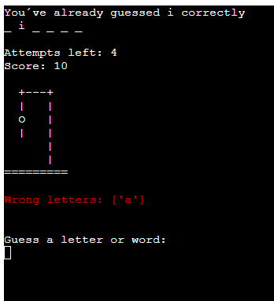

### Correct Word Input

* If the player guesses the right word in the first game, they are told the correct word and that they have won. Their total score is automatically the maximum of 500. The Leaderboard is updated with this information. 
### End of the second game:

* If the player guesses the whole word correctly in the second game and thereafter, they are presented additionally with their cumulative scores. 
### Wrong word input

* If a player inputs a wrong word for the first time, they are informed the word is wrong and they lose an attempt. The word is stored in a wrong word list but not displayed to the player.

* If the player puts in the same wrong word, they get told this but their attempts do not reduce by one.

## Hangman Stages
### Hangman Stage 1
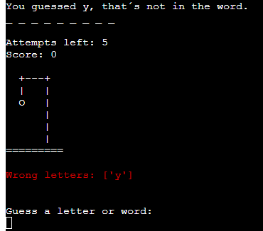

* If the player guesses the letter wrong for the first time the hangman starts and the head is shown.
### Hangman Stage 2
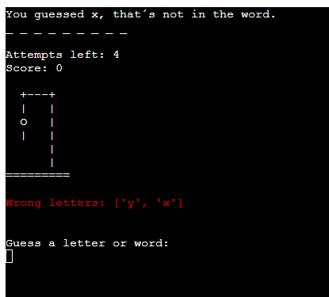

* The body is shown at this second stage of the hangman.
### Hangman Stage 3
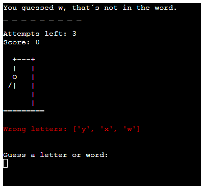

* At this stage the right arm is shown of the hangman.
### Hangman Stage 4
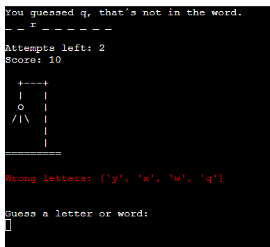

* At this stage the left arm is shown of the hangman.
### Hangman Stage 5
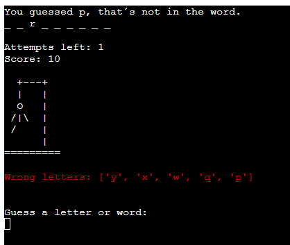

* At this stage the right leg is shown of the hangman.
### Hangman Stage 6
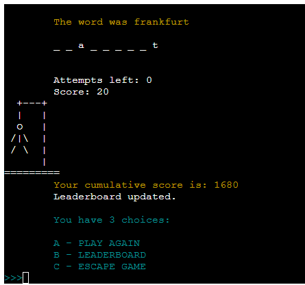

* At this stage the right leg is shown of the hangman.

## End Choices

* At the end of playing a game, the player is given three choices: playing again, seeing the leaderboard, or exiting the game.
### Play again

* If the player chooses this option, the game restarts with a new unknown word for the player to guess. At the end of playing this second game, the player is presented with their cumulative scores. 

### Leaderboard

* If the player chooses option "b", they get shown the scores of the top five players.
### Exit Game

* At the end of the game the player can choose to exit the game and that ends the program.

## Future Features
### Multiple-player option
### Different word categories
* To make the game more interesting, especially for returning players, they could be asked at the beginning of the game to choose which country or nation they are lost in with a different word list pertaining to cities in that country or nation. 
### Wider range of words
### Use of the datetime module
### More advanced graphics
### Updated Scoring System
* If a letter in the word appears more than once, the score of 10 for each correct letter should be multiplied by how many times that letter appears in the word.
* To prevent players from inputting the whole word to get the maximum score of 500 after guessing the word and only one letter is left to guess. If there are only 2 letters left to guess the word, the user should be prevented from guessing the whole word. 

### Feedback section

* The player could be asked before exiting the game if they want to leave feedback or not. This feedback could be stored in the Google worksheet.

### Correction section
* If a player has misspelled their name or city, they should be able to have a choice to change this, so that their cumulative scores are stored under the right input.

# Storage Data
Google Sheets was used to store player names, cities, dates, and scores. This worksheet is connected to the Python code through the Google Drive and Google Sheet API from the Google Cloud Platform. With the Google Sheet API Credentials, I was able to send data collected from the app store it in the Google Sheet, and display the stored data as output information for the player. The sensitive credentials were saved in a creds.json file. By making sure this file´s name was in the gitignore file, it was not pushed to the repository on GitHub. By deploying the program to Heroku, the information from the creds.json file was stored securely in the config Vars. 

## Code to Connect to Google Sheet
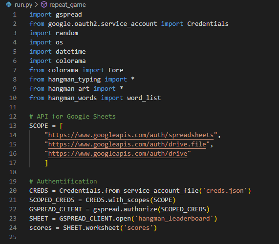

## Google Sheet Hangman Leaderboard
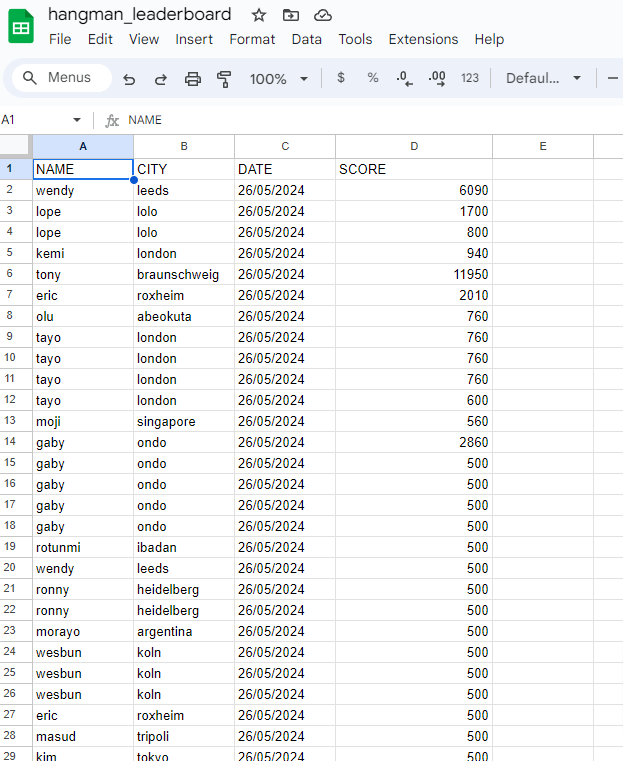

# Technolgies Used

## Language Used

* [Python 3.12](https://www.python.org/).

## Python Packages
* [os] (https://docs.python.org/3/library/os.html): clears the screen at different stages of the program.
* [Random](https://docs.python.org/3/library/random.html?highlight=random#module-random): returns a random integer to get a random word
* [sys](https://docs.python.org/3/library/sys.html): used for the typing function
* [time](https://docs.python.org/3/library/time.html): returns the time
* [Datetime](https://pypi.org/project/DateTime/): returns the full date
* [Gspread](https://pypi.org/project/gspread/): allows communication with Google Sheets
* [Colorama](https://pypi.org/project/colorama/): allows terminal text to be printed in different colours / styles
* [Time](https://pypi.org/project/time/): defined time sleep
* [google.oauth2.service_accoun](https://google-auth.readthedocs.io/en/stable/index.html): credentials used to validate credentials and grant access to Google service accounts

## Frameworks - Libraries - Programs Used
* [Git](https://git-scm.com/)
    * Git was used for version control by utilizing the Gitpod terminal to commit to Git and Push to GitHub.
* [GitHub:](https://github.com/)
    * GitHub is used to store the project's code after being pushed from Git.
* [GitHuv](https://derlin.github.io/bitdowntoc/)
    * This link was used to create the table of contents for the README file.
* [Gitpod](https://gitpod.io/)
    * Gitpod was used to write my code.
* [Draw.io:](https://app.diagrams.net/)
    * Draw.io was used to draw the flowchart for the whole structure of the program.
* [Cloudinary:](https://cloudinary.com/)
    * The images linked in the readme file are stored here.
* [Heroku:](https://heroku.com/)
    * Heroku was used to deploy the project.
* [Google Sheets:](https://heroku.com/)
    * Google Sheets was used to store the user´s input information, and the date and to track the scores of the user.
    You can view the Google Sheets file [here](https://docs.google.com/spreadsheets/d/1a4cQ8MmqxNLSOMSEqPsuPDMlvOTl8-AqtlW-sh9tqBc/edit?usp=sharing).

# Testing
## Code Institute Python Linter 
[CI Python Linter](https://pep8ci.herokuapp.com/) 
The CI Python Linter was used to validate every Python file in the project to ensure there were no syntax errors in the project.

run.py - CI Python Linter Check

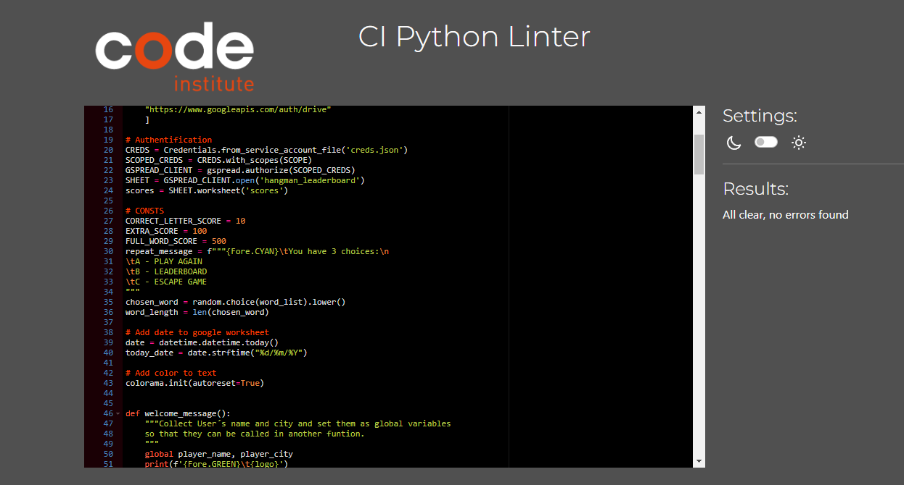

hangman_words.py - CI Python Linter Check

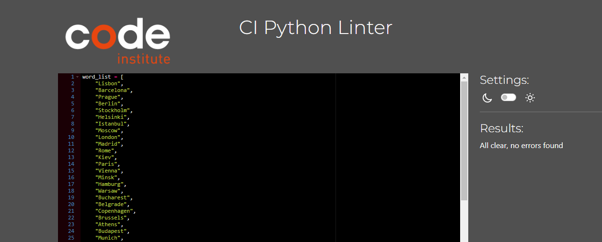

hangman_art.py - CI Python Linter Check

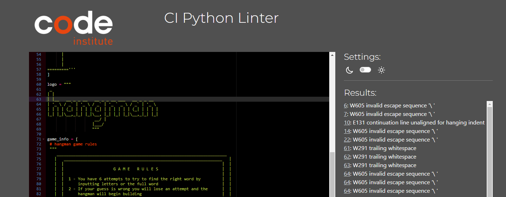

hangman_typing.py - CI Python Linter Check

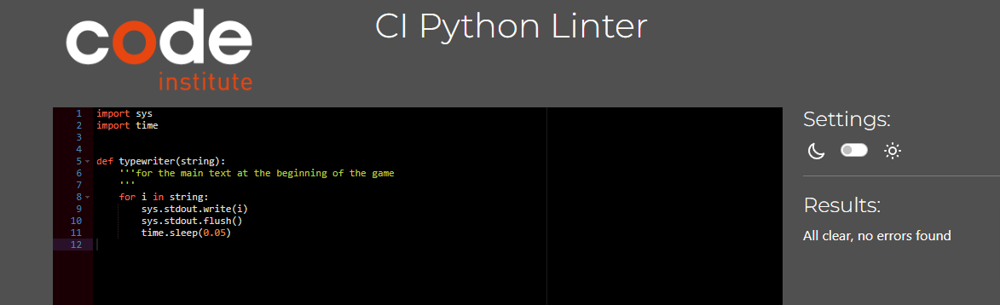

Google Lighthouse Check

## Manual Testing

The game has been manually tested multiple times during the coding phase. Additionally, it was checked after being deployed to Heroku to ensure that all features were displaying as intended. Furthermore, friends and relatives have also tested the game. 
Testing was performed on various aspects such as: 

| Feature | Expected Result | Steps Taken | Actual Result | Screenshot |
| ------- | ----------------| ------------ | ------------ | ----------|
| Start Screen | To show the logo and the welcome message| None | As intended |  |
| Display Rules | To display the rules and scoring system of the game| None | As intended |  |
| Player Name| To get the player´s name and use it in the game´s messages | Insert alphanumeric player city | As intended |  |
| Player city| To get the player´s city and store it in Google worksheet | Insert alphanumeric player city | As intended | 
| Guess a letter or a word | Prompts the player to guess a letter or go for the whole word | Input a letter or a word to guess | As intended |  |
| Correct Guess | To display the position of the letter, the hangman with no lost attempts | Guessed a correct letter | As intended | 
| Incorrect Guess | To display an incorrect message, the hangman with the remaining attempts and the wrong letter list | Guessed the wrong letter | As intended |  |
| Repeated Guess | To display a message saying the input was already guessed, if wrong no penalty applied | Input a letter previously inserted | As intended |   |
| Word Guess | To display a message saying if the word is correct or wrong | Input a word | As intended |    |
| Hangman Stages | To show the updated hangman stages | Input several letters | As intended |   |
| Win The Game | To show congrats message and show the word | Guess the word in less than 6 attempts| As intended |   |
| Lose The Game | To show a message confirming the loss | Fail to guess in 6 attempts| As intended |  |
| Play Again | To display the play again choice message | Choose between a, b, or c | As intended |  |
| Play Game Again | Game starts again | Choice A| As intended |  |
| Leaderboard | To display the leaderboard | Choice B | As intended |  |
| Exit Game | Exit Game | Choice C | As intended |  |

## Input validation testing
### Enter player name
    * Playername cannot be empty

### Enter player city
    * Playercity cannot be empty

### Enter a letter or word
    * Can only contain letters
    * Can not contain numbers

### Play Again Input
    * Can only contain letters "a", "b" or "c"

# Bugs 
## Fixed Bugs
* In the initial setup of the creds.json file, by mistakenly omitting the "s" in creds.json while writing it in the gitignore file, it was sent to the repository on GitHub and remained there in the history. I got alerts from Gitpod, GitHub, and an email from Google informing me of this error. Through research, I was [here]( https://www.git-tower.com/learn/git/commands/git-rm), I was able to use the rm command on git to delete the creds.json file in the repository history as well as from the filesystem. I then created a new Google sheet API and Drive with a new creds.json file that I made sure to save correctly on the gitignore file. 
*  At the initial stages of the project the complete data of players were repeatedly stored in separate rows every time a player played a game more than once. The scores were not being added up after every game. I had to research and learn how to get the whole records of the sheet search for the player´s name and then update the score cell. I then had to amend this and add the city as a second search criterion in case there were two players with the same name. 
* It took much trial and error to use the sorted function in Python to sort through all the scores get the top five scores and display this in a table format to the user.
* After the city input from the player, the typewriter writes a message that is cleared so fast that the message might be lost. To fix this the typewriter function in the hangman_typeing.py file had to be adjusted to include a delay time of 1 second after the for loop to display the sentences.

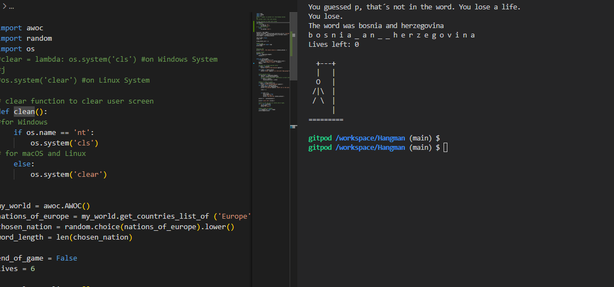

* Cities with more than 1 word could not be correctly displayed because the space between the words would also be counted and displayed with a blank space. This bug was sidestepped by not having any city names in the word list with more than one word.

## Unfixed Bugs
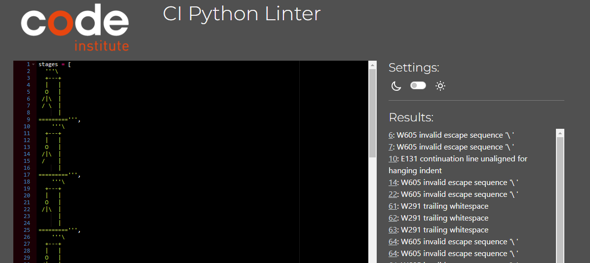

* The ASCII images of the hangman stages and the other created art images give errors in the CI Python Linter Checker due to the "/" forward slashes and trailing white spaces that were used to create the images. The fix would be to get PEP8-compatible ASCII images. Due to time constraints, this was not implemented.

. 

* If a guessed letter appears more than once in the displayed chosen word, it should get a score equivalent to the number of times it appears and not just count once like it is now in the code.

* To compensate for long city names, the leaderboard shows the city name at the end of the table. No such compensation was made for possible long player-name inputs. This could be coded into the welcome function to limit the number of characters a user can input for both player name and player city.

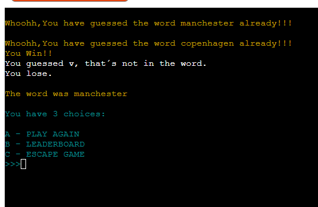. 

* After choosing to play the game again, the end messages of the games thereafter would not clear from above the screen. 

# Deployment
This project was developed using GitPod, committed, and pushed to GitHub using a GitPod terminal.

## Deploying on Heroku 
To deploy this page to Heroku from its GitHub repository, the following steps were taken:

1. Create a new app in Heroku.
2. Select "New" and "Create new app".
3. Name the new app and click "Create new app".
4. Click on the "Settings" tab at the top of the page
5. Open the "Reveal Config Vars" section and input the following information - KEY: PORT, VALUE: 8000.
6. Under the Config Vars section in "Settings" select "BuildPack" and select Python and Nodejs, Make sure they are in this order.
7. Now go to the "Deploy" tab at the top of the page and select your deploy method and repository.
8. In "Deployment Method" click on "GitHub" to connect them.
9. Once they are connected search for the repository you want and hit "connect".
10. Either choose "Enable Automatic Deploys" or "Deploy Branch" in the manual deploy section. Note, if you click on Automatic Deploys, you will still need to hit deploy branch to build the site
11. Heroku will now deploy the site.
12. Deployed site [Hangman](https://hangmann-game-051c0aa67667.herokuapp.com/).

## Forking the GitHub Repository 

By forking the repository, we make a copy of the original repository on our GitHub account to view and change without affecting the original repository by using these steps:

1. Log in to GitHub and locate GitHub Repository [Hangman](https://github.com/angelaanjorin/Hangman). 
2. At the top of the Repository (under the main navigation) locate the "Fork" button.
3. Now you should have a copy of the original repository in your GitHub account.

## Local Clone

To make a local clone in GitHub, please follow the steps below:

1. Log in to GitHub and locate GitHub Repository [Hangman](https://github.com/angelaanjorin/Hangman).
2. Under the repository name click "Clone or download"
3. Click on the code button, select clone with HTTPS, SSH, or GitHub CLI, and copy the link shown.
4. Open Git Bash.
5. Change the current working directory to the location where you want the cloned directory to be made.
6. Type `git clone` and then paste The URL copied in step 3.
7. Press Enter and your local clone will be created.

# Credits

## Information Sources/Resources

* [Git tower:](https://www.git-tower.com/learn/git/commands/git-rm).
* [Python:](https://www.python.org/).
* [gspread:](https://www.gspread.org/).
* [Code Institute:](https://learn.codeinstitute.net/).
* [Stack Overflow](https://stackoverflow.com/).
  

## Content

* All the text content is original. I got inspiration from the following :

    1. [Love Sandwiches](https://github.com/Code-Institute-Solutions/love-sandwiches-p5-sourcecode)
    2. [100 days of Code by Dr. Angela Yu ](https://www.udemy.com/user/4b4368a3-b5c8-4529-aa65-2056ec31f37e/)
    3. [Portfolio Project 3 by Pedro Cristo](https://github.com/PedroCristo/portfolio_project_3)
    4. [CodeWithdar](https://github.com/CodeWithdar/python-tutorials-/blob/main/main.py)
    5. [Portfolio Project 3 by Monica Iancu](https://github.com/Monicaular/hangman-pp3)

### Images

* [Logo and Hangman Images:](https://ascii.co.uk/art/hangman)
    * The logo and Hangman images were obtained from the above ASCII webpage.
* [Game rules:](https://github.com/PedroCristo/portfolio_project_3)
    * The code for the game rules display was taken from Pedro Cristo, an alumnus of Code Institute.
  
# Acknowledgements
 * Thanks to my Mentor Gareth McGirr for his assistance throughout the project.
 * Special thanks to my partner and alumni of Code Institute Eric Jones for his assistance throughout this project.